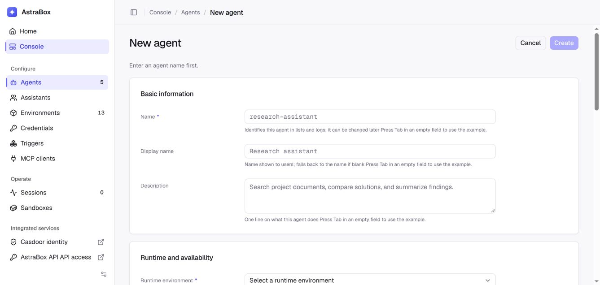

# Quickstart

> Run your first AstraBox Agent in five steps.

Get your first AstraBox Agent running in five steps: start AstraBox, select an Environment, create an Agent, create a Session, and exchange messages. After the self-hosted deployment is running, no SDK installation is required.

## Prerequisites

- A Linux host (or WSL 2) running Docker Engine with the Compose plugin, v2 or
  later, and a user that can use the Docker socket
- An API key for a model service: Anthropic, DeepSeek, or another
  Anthropic-compatible or OpenAI-compatible service
- `curl` and `jq`
- A web browser

:::note
**For Windows users:** These commands use bash syntax. Run them in WSL 2 (install with `wsl --install`), where Docker Desktop's WSL integration provides the Docker socket.
:::

Agent model requests go through the bundled gateway,
[LiteLLM](https://docs.litellm.ai/). The installer writes the settings for the
model service you choose; you can add more routes later, including
OpenAI-compatible services and local models, as described in
[Connect a model](models.md). An Environment then selects the endpoint and
administrator-managed credential.
Protected delivery is enabled by default: the Agent sees a placeholder, while
the bundled OpenSandbox provider adds the real credential only to matching
model requests outside the sandbox process. Other sandbox providers must map
the same protected Vault delivery; a provider without that capability reports
it as unsupported.

## Step 1: Start AstraBox

Run the installer on the Docker host:

```bash
curl -fsSL https://raw.githubusercontent.com/Colton-z/AstraBox/main/scripts/install.sh | bash
```

It asks which model service your Agents use, and for that service's API key and
model ID. It then installs the latest release into `~/astrabox`, pulls the
published images, starts them, and prints the console address.

Open <http://127.0.0.1:8088> in your browser.

:::note
To run AstraBox from a clone instead, see
[Run from a clone](deploy.md#run-from-a-clone). For an unattended installation,
a registry mirror or a host without GitHub access, see
[Installer settings](deploy.md#installer-settings).
:::

:::warning
The local deployment has no authentication and listens on loopback only. Configure [team login](team-login.md) and TLS before exposing AstraBox on a shared or public address.
:::

## Step 2: Select an Environment

Open **Console > Environments**. Select an enabled Environment that provides the Agent program, sandbox, network access, and model connection you want to use.

:::note
If no suitable Environment is available, create one before continuing. See [Environments](environments.md) for the available settings.
:::

## Step 3: Create an Agent

Open **Console > Agents**, then click **New agent**. Enter a name, select the Environment from Step 2, and select or enter a model. The system Prompt, MCP servers, Skills, Plugins, repository, and other settings are optional; configure only what this Agent needs. Click **Create**.



## Step 4: Create a Session

Open **Home > Agents**, find the Agent you created, and click **Start conversation**. AstraBox creates a Session and opens it in the web app.

:::note
The Agent begins executing only after you send it a message in the next step.
:::

## Step 5: Send a message and receive Events

Enter a task such as `Write a Python function that calculates fibonacci numbers`, then send the message. The page displays the Agent's response and other Session Events in real time.

:::note
The task runs in AstraBox, not in the browser. You can leave the page and return to the Session from the sidebar while the Agent continues working.
:::

## End-to-End Script

An Agent's writable fields are declared by the Agent program selected through
its Environment, so AstraBox cannot use one fixed Agent JSON object for every
deployment. After completing Steps 1–3, this script finds that Agent by name,
creates a Session, sends a message, and streams the result:

```bash
#!/usr/bin/env bash
set -euo pipefail

SERVICE_URL="${SERVICE_URL:-http://127.0.0.1:8088}"
AGENT_NAME="${1:?Usage: bash quickstart.sh <agent-name>}"

AGENT_ID=$(curl --fail --silent --show-error "$SERVICE_URL/api/v1/agents" \
  | jq -er --arg name "$AGENT_NAME" \
    '[.data[] | select(.name == $name)][0].agent_id')

SESSION_ID=$(curl --fail --silent --show-error --request POST \
  "$SERVICE_URL/api/v1/agents/$AGENT_ID/conversations" \
  --header 'Content-Type: application/json' \
  --header 'Idempotency-Key: quickstart-session' \
  --data '{}' \
  | jq -er '.data.session_id')

curl --fail --no-buffer --silent --show-error --request POST \
  "$SERVICE_URL/api/v1/sessions/$SESSION_ID/ai-stream" \
  --header 'Content-Type: application/json' \
  --data '{
    "content": "Write a Python function that computes Fibonacci numbers and run a test.",
    "client_message_id": "quickstart-turn-1"
  }'
```

For a deployment with team login, add the bearer token described in
[Authentication](api-authentication.md) to each request.

## FAQ

**Q: What should I do if the console does not open?**

A: Check the services with `cd ~/astrabox/containers && docker compose ps`, and open <http://127.0.0.1:8088> on the host itself; the console is not published to other addresses. See [Deploy AstraBox](deploy.md) for deployment troubleshooting.

**Q: Why can't I create an Agent?**

A: Ensure the name, Environment, and model are set. The selected Environment must be enabled and must support Agent conversations.

**Q: Why is my Session not receiving Events?**

A: Send a message to trigger the Agent. If the task fails, open **Console > Errors** to see the recorded failure.

**Q: What should I do if the browser connection is interrupted?**

A: Reopen the Session from the sidebar. AstraBox stores the Session and its Event stream, so the page can load the saved history and resume following new Events.

**Q: Why are no Environments available when I create an Agent?**

A: The deployment has no enabled Environment that supports Agent conversations. Create or enable one as described in Step 2.

## Next steps

- [Define an Agent](authoring-agents.md) — Learn about all Agent configuration fields.
- [Environments](environments.md) — Customize your runtime Environments.
- [Start a Session](sessions.md) — Dive deeper into Session management.
