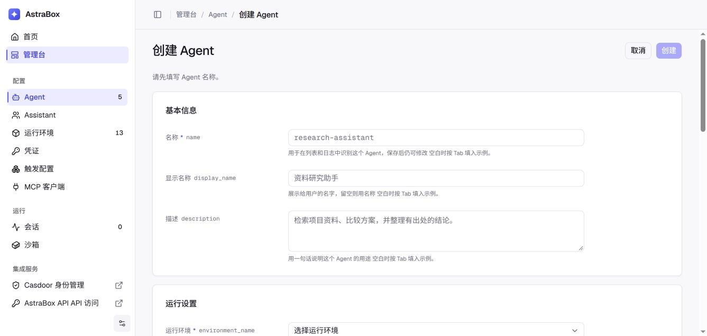

# 定义 Agent

Agent 会在 AstraBox 中运行已安装的 Agent 程序，并使用所选模型、系统提示词、扩展和运行环境。一个 Agent 可被多个 Session 复用。保存 Agent 不会打断正在执行的任务；AstraBox 在首次准备或重建 Session 运行实例时，会读取最新保存的 Agent 和运行环境。

## 核心要素

可以把 Agent 理解为一份”岗位说明书”：

| 要素 | 含义 |
| --- | --- |
| **模型** | Agent 的智力水平 |
| **系统提示词** | Agent 的行为准则 |
| **MCP 服务器** | Agent 可以调用的外部服务 |
| **Skill 和 Plugin** | Agent 可以使用的流程和扩展 |

Agent 在 Session 中执行任务。AstraBox 让 Agent 随时可用，创建或复用它的沙箱，实时返回进度，并把 Session 保存在沙箱之外。

## 字段参考

| 字段 | 类型 | 必填 | 说明 |
| --- | --- | --- | --- |
| `agent_id` | string | — | 系统生成的 Agent ID |
| `name` | string | 是 | Agent 名称 |
| `description` | string | 否 | Agent 的说明 |
| `use_cases` | array | 否 | 这个 Agent 适合处理的任务示例 |
| `display_meta` | object | 否 | 客户端显示的名称、图标和标签 |
| `model` | string | 是 | 模型标识，详见下文 |
| `system` | string | 否 | 系统提示词 |
| `engine_options` | object | 否 | 运行环境所选 Agent 程序定义的高级配置 |
| `skills` | array | 否 | 加载到 Session 沙箱中的 Skill 来源 |
| `mcp_servers` | object | 否 | MCP 服务器配置，以服务器名称为键 |
| `default_repo` | object | 否 | 每个新 Session 默认克隆的代码仓库 |
| `plugin_repos` | array | 否 | 要安装的 Plugin 仓库及经过审核的版本 |
| `environment_name` | string | 是 | 提供 Agent 程序、沙箱、网络策略和模型连接的运行环境 |
| `exposure_mode` | string | 否 | Agent 的使用入口：`chat_only`、`mcp_only` 或 `both` |
| `idle_hibernate_seconds` | integer | 否 | Session 运行实例空闲多久后执行运行环境设置的暂停或回收方式 |
| `prewarm_enabled` | boolean | 否 | AstraBox 是否为这个 Agent 保持准备完成的运行时 |
| `enabled` | boolean | 否 | Agent 是否可以启动新 Session |
| `visibility` | string | — | Agent 鉴权模式：`public`、`private` 或 `allowlist`，通过 Agent access 接口管理 |
| `admins` | array | — | 可以管理 Agent 的账户，通过 Agent access 接口管理 |
| `allowed_user_ids` | array | — | `allowlist` 鉴权允许的账户，通过 Agent access 接口管理 |
| `version` | integer | — | 用于乐观并发控制的序号，从 1 开始；用于准备 Agent 运行实例的设置发生变化时递增 |
| `state` | string | — | Agent 生命周期状态 |
| `created_at` | string | — | 创建时间，ISO 8601 格式 |
| `updated_at` | string | — | 最后更新时间 |

### model

`model` 为字符串类型，指定 Agent 使用的模型。AstraBox 会把这个标识传给所选运行环境配置的模型服务：

| 值 | 说明 |
| --- | --- |
| `ANTHROPIC_MODEL` 配置的值 | 内置 Anthropic 兼容路由提供的模型 |
| 所选模型服务提供的任意模型 ID | 外部 LiteLLM 网关、OpenAI 兼容服务或本地模型服务提供的模型 |

自托管部署不受固定厂商目录限制。模型服务地址和凭证配置参见[连接模型服务](models.md)。

### 原生运行配置 JSON {#native-runtime-json}

先选择运行环境：对应的 Agent 程序会声明可覆盖的 JSON 配置块。每个编辑器都会说明
原生目标及合并规则。平台校验块名称、JSON 对象格式和平台管理的字段；块内厂商配置的
含义及未知字段的处理方式，由已安装的 Agent 程序决定。适配器将配置传给程序自身的
文件或 API。凭证通过受管理的模型连接和 Credential Vault 分配，不作为运行配置 JSON
中的覆盖值。

| Agent 程序 | `engine_options` 配置块 | 原生目标 |
| --- | --- | --- |
| Claude Code | `sdk_options` | `ClaudeAgentOptions`；嵌套的 `settings` 序列化后传给 CLI 的 `--settings`。 |
| Codex | `config` | `thread/start` 和 `thread/resume` 的配置覆盖值。 |
| Codex | `turn_start` | 每次 `turn/start` 的参数对象。 |
| Codex | `model_catalog` | 完整的原生 `models.json` 对象。 |
| Pi | `settings` | 当前对话的 `~/.pi/agent/settings.json` 根对象。 |
| DeepSeek Harness | `session_create` | 原生 `session/create` 请求参数，包括 `agentPreset`。 |

输入 `{}` 表示传入空对象，清空编辑器则移除对应配置块。运行配置 JSON 与模型网关配置
各有用途，可以同时使用。部署配置了 LiteLLM 管理地址时，模型字段会提供相应入口。
Session 身份、通信设置和已分配的模型凭证由平台管理。

### MCP 服务器、Skill 和 Plugin

读写文件、编辑代码和执行命令等原生工具由所选 Agent 程序提供，AstraBox 不会重新定义这些工具。Agent 使用相应程序支持的原生格式配置 MCP 服务器、Skill 和 Plugin。在「管理台 > Agent」中打开一个 Agent，即可选择管理员配置的远程 MCP 服务和 Skill，也可以直接添加 Plugin 仓库。

更多配置参见 [MCP 服务器、Skill 和 Plugin](adding-tools.md)。

## 管理 Agent

网页控制台支持下面这些常用操作。通过程序管理 Agent 时，请参见 [HTTP API](api.md)。

### 创建

打开「管理台 > Agent」，点击「创建 Agent」，填写名称、运行环境和模型。系统提示词和所有扩展都可以不配置；根据这个 Agent 要完成的任务选择即可。完成后点击「创建」。

开启预热后，AstraBox 会在下一个 Session 使用前准备运行实例。Agent 配置、所选 Skill
与 Plugin，以及 Agent 程序启动会在可领取前完成。Agent 页面中的**预热状态**会显示
是否已有就绪资源，或准备是否失败。



### 查看

打开「管理台 > Agent」可以查看当前账号有权访问的 Agent。选择一个 Agent，即可查看它的模型、运行环境和能力；拥有管理权限时，还可以修改配置和鉴权设置。

### 更新

打开 Agent，修改需要调整的部分，然后点击该部分的「保存」。控制台会自动携带当前 `version`；如果其他人同时修改了这个 Agent，保存会返回冲突，不会静默覆盖对方的修改。保存不会重新配置正在执行的任务；AstraBox 在首次准备或重建 Session 运行实例时使用最新设置。

需要按已保存的配置重新拉取 Skill 和 Plugin 时，在**预热状态**中选择**重新预热**。
操作前先保存或撤销待提交修改。重新预热只替换尚未被 Session 领取的准备资源，现有
Session 使用的沙箱保持运行。固定到 commit 的仓库会使用该 commit，直到配置中的
版本被修改。

### 删除

当前通过 `DELETE /api/v1/agents/{agent_id}` 删除 Agent。删除会使 Agent 不再可用，并开始释放它拥有的运行资源。现有 Session 记录和对话内容仍会保留，但它引用的 Agent 被删除后，Session 无法再启动或重建运行实例。

## 版本管理

Agent 采用乐观并发控制（OCC）机制：

- 创建时 `version` 从 `1` 开始
- 成功修改运行字段后，`version` 自动加 1
- 更新请求可以携带当前 `version`；如果与服务端版本不一致，AstraBox 返回 **409** `AGENT_VERSION_CONFLICT`
- 更新请求也可以不带 `version`，但应用更新时检测到并发写入仍会返回 **409**

这避免了多人 / 多系统并发修改时互相覆盖。

### 处理 409 冲突

当持有的版本已过期时：

```json
{
  "code": "AGENT_VERSION_CONFLICT",
  "message": "agent version mismatch: supplied 1, stored 2",
  "data": null
}
```

恢复步骤：

1. `GET` 最新 Agent 拿到当前 `version`
2. 合并自己的变更
3. 用新 `version` 重新 `PUT`

## 最佳实践

1. **命名规范** — 用 `团队-用途` 格式，如 `backend-code-review`、`frontend-test-gen`
2. **提示词精炼** — `system` 字段写清角色、输出格式、限制条件
3. **最小权限原则** — 只添加任务需要的 MCP 服务器、Skill、Plugin、代码仓库、凭证和网络地址
4. **善用展示信息** — 添加清楚的说明和标签，帮助用户找到合适的 Agent
5. **自动更新时检查版本** — 服务修改 Agent 时携带版本，让并发修改产生冲突，而不是互相覆盖

已安装的 Agent 程序需要把工作拆分为 child run 时，参阅
[Multiagent 编排](multi-agents.md)。

## 常见问题

**Q：Agent 的网络策略如何与扩展和凭证配合？**

A：
需要开放全部互联网访问时使用 `networking.type: unrestricted`。`limited` 只允许
列出的地址，以及 AstraBox 能确定的模型地址、平台回调地址和 Plugin 仓库地址；只有
`allow_mcp_servers` 为 true 时才允许 Agent 声明的远程 MCP。Credential Vault 分配保持
Environment 记录原样，并把 binding 地址加入沙箱的有效策略。

**Q：更新 Agent 后，正在运行的 Session 会受影响吗？**

A：保存不会打断正在执行的任务。Session 会继续使用当前运行实例；需要首次准备或重建运行实例时，AstraBox 会读取最新保存的 Agent 和运行环境。

**Q：MCP 服务器、Skill 和 Plugin 列表可以为空吗？**

A：可以。Agent 程序仍然保留自己的原生能力。只有在需要外部服务、可复用流程或扩展命令时才需要添加。

**Q：`name` 字段有长度限制吗？**

A：AstraBox 没有设置固定长度限制。名称应当简洁，让用户可以在控制台和集成中辨认。

**Q：如何恢复先前的 Agent 配置？**

A：AstraBox 不保存可选择的历史配置。建议在更新前自行保存 Agent 配置；需要恢复时，使用最新 `version` 通过 `PUT` 写回先前保存的配置。

## 下一步

- [运行环境](environments.md) — 配置 Agent 的运行位置
- [启动 Session](sessions.md) — 使用 Agent 创建 Session
- [MCP 服务器、Skill 和 Plugin](adding-tools.md) — 配置扩展和凭证
- [Multiagent 编排](multi-agents.md) — 查看和控制委派的 child run
